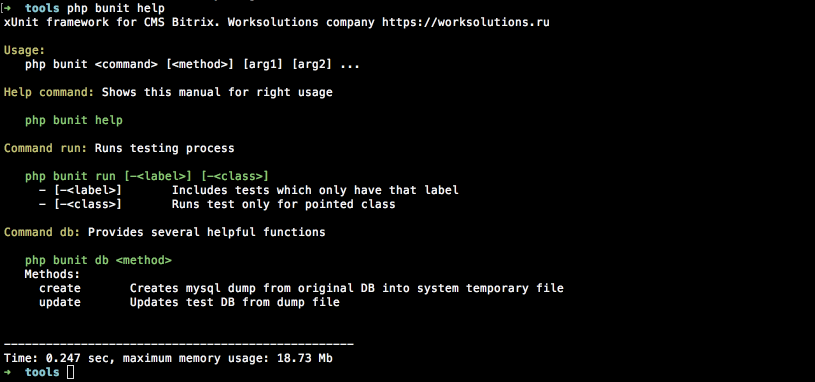
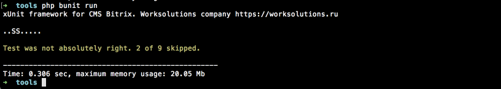
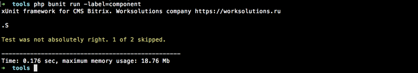
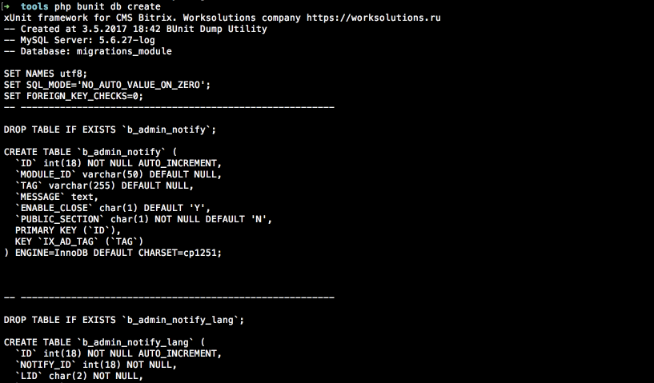
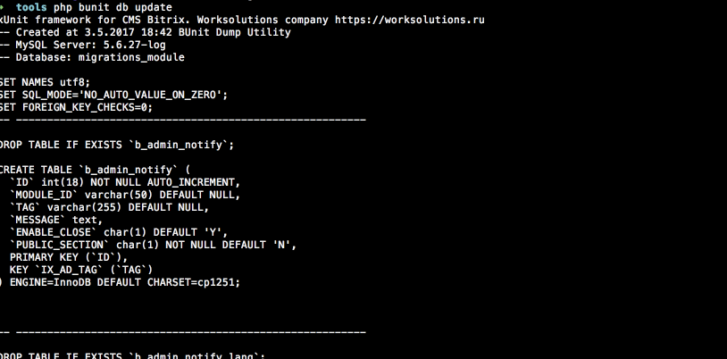

##### [Главная страница](../readme.md)

# Запуск тестов

Запуск тестов происходит только через интерфейс командной строки. Файл для запуска содержится в каталоге ```КОРЕНЬ_ПРОЕКТА/bitrix/tools/bunit```.
Функционал командной строки модуля состоит из нескольких функций: *помощь, запуск и работа с клонированием данных в тестовую базу данных*.

## Функция помощи

Функция помощи кратко описывает взаимодействие с модулем тестирования.

```$ php bunit help```




## Запуск тестов

Для запуска тестов используется функция ```run``` которая так же может содержать доплнительный параметры, в зависимости от требований к выполнению тестов.

```$ php bunit run```

*Запуск всех тестов. Успешный проход.*


*Запуск всех тестов. Есть тесты отмеченные как пропущенные.*



*Запуск группы тестов.* Используется параметр ```label```

```$ php bunit run -label=component```



## Работа с клонированием в тестовую базу данных

При тестировании работы функционала с базой данных лучше использовать отдельное хранилище данных. Лучшим способом для этого является клонирование данных из используемой базы данных в тестовую. При этом тестовые изменения не затрагивают данные проекта и в то же время есть возможность держать тестовую базу данных в актуальном состоянии.

```Используется только в случае если указаны параметры доступа тестовой базы данных```

##### Сохранение снимка оригинальной базы данных во временное хранилище

```$ php bunit db create```



##### Восстановление данных тестовой базы данных из созданного снимка оригинальной бд

```$ php bunit db update```


