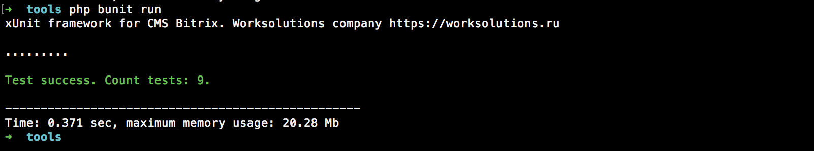

Фреймворк модульного тестирования bunit
=======================================

[Модульное тестирование](https://ru.wikipedia.org/wiki/%D0%9C%D0%BE%D0%B4%D1%83%D0%BB%D1%8C%D0%BD%D0%BE%D0%B5_%D1%82%D0%B5%D1%81%D1%82%D0%B8%D1%80%D0%BE%D0%B2%D0%B0%D0%BD%D0%B8%D0%B5), иначе говоря юнит тестирование используется повсеместно для повышения качества разработки проектов разного направления и уровня. Модуль является инфтрументом организации модульного тестирования проекта.

1. Тест

```php

    /**
     * @test
     */
    public function iblocksNotEmpty() {
        CModule::IncludeModule("iblock");
        $dbResult = CIBlock::getList(array(), array());
        $this->getAssert()->asTrue($dbResult->AffectedRowsCount() > 0, "Count of iblocks should be more than 0");
    }

    /**
     * @test
     */
    public function hasNewsIblock() {
        $result = CIBlock::getList(array(), array("CODE" => "news"))->fetch();
        $this->getAssert()->asTrue((bool) $result);
    }

```

2. Запуск


####[Устанавливаем и настраиваем](doc/install.md)

####[Пишем тесты](doc/writing.md)

####[Запускаем тесты](doc/runnig.md)

####[Работаем с тестовой средой](doc/using-test-env.md)
