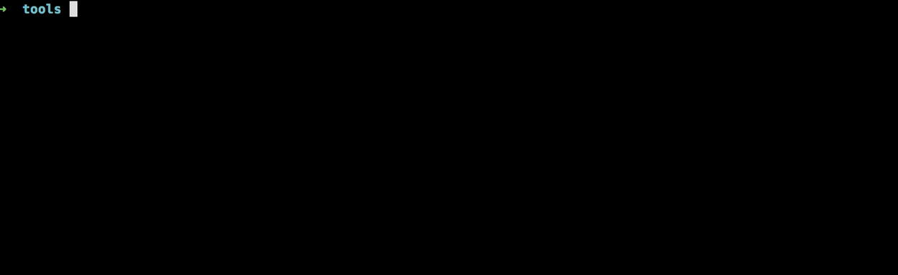

Фреймворк модульного тестирования bunit
=======================================

Автоматизирует [модульное тестирования](https://ru.wikipedia.org/wiki/%D0%9C%D0%BE%D0%B4%D1%83%D0%BB%D1%8C%D0%BD%D0%BE%D0%B5_%D1%82%D0%B5%D1%81%D1%82%D0%B8%D1%80%D0%BE%D0%B2%D0%B0%D0%BD%D0%B8%D0%B5) проекта. Прост в установке (Сomposer, Marketplace) и использовании.

1. *Тест*

```php
<?php

class IblockAmountTestCase {
    /**
     * @test
     */
    public function iblocksNotEmpty() {
        CModule::IncludeModule("iblock");
        $dbResult = CIBlock::getList(array(), array());
        $this->getAssert()->asTrue($dbResult->AffectedRowsCount() > 0, "Число инфоблоков должно быть больше нуля");
    }

    /**
     * @test
     */
    public function hasNewsIblock() {
        $result = CIBlock::getList(array(), array("CODE" => "news"))->fetch();
        $this->getAssert()->asTrue((bool) $result, "Отсутствует инфоблок новостей");
    }
}
```

2. *Результат*



### [1. Устанавливаем и настраиваем модуль](doc/install.md)

### [2. Пишем тесты](doc/writing.md)

### [3. Запускаем провеку](doc/running.md)
